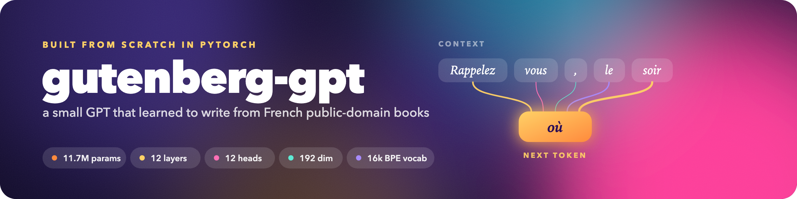

<p align="center">
  
</p>

# gutenberg-gpt

A decoder-only transformer, written from scratch in PyTorch, trained on French public-domain books from Project Gutenberg.

I built this to stop treating attention as a black box. Every piece of the model is hand-rolled here: the attention head, the multi-head wrapper, the feed-forward block, the residual stream, the training loop. The one thing I did not write myself is the BPE trainer, which comes from Hugging Face `tokenizers`. Most walkthroughs of this kind stop at a single Shakespeare file, so I pointed mine at a few thousand French novels instead and trained the tokenizer on the same texts.

## What's in here

```
.
├── config.json                    model and training hyperparameters
├── .env.example                   optional path overrides
├── requirements.txt
├── artifacts/                     tokenizer and checkpoints land here
├── data/
│   ├── books_clean/               the corpus, one plain-text book per file
│   └── bin/                       tokenized train.bin / val.bin
└── src/gutenberg-gpt/
    ├── model.py                   the transformer
    ├── gutenberg_tokenizer.py     byte-level BPE tokenizer
    ├── train.py                   data prep and training loop
    ├── inference.py               sampling from a checkpoint
    ├── config.py                  reads config.json
    └── paths.py                   resolves every path, honours .env
```

`data/` and `artifacts/` are gitignored, so a fresh clone gives you the code and nothing else. You bring the books, the rest gets built.

## How it works

**Tokenizer.** A byte-level BPE with a vocabulary of 16384 and a single special token, `<|endoftext|>`, appended to the end of every encoded document. Byte-level matters more than it sounds for French: accented characters, ligatures and the old typography scattered through Gutenberg texts never produce an unknown token, they just cost a few extra bytes. Training runs on a random 5% sample of the training files, which is plenty for BPE and a lot faster than reading 700 MB.

**Data.** Books get tokenized once into two flat `uint16` files, `train.bin` and `val.bin`. Training reads them back with `np.memmap` and slices random windows out of them, so nothing large ever sits in memory and the split stays at the book level rather than the sentence level.

**Model.** Standard GPT-style stack: token embeddings plus learned position embeddings, then N pre-norm blocks, each one causal self-attention followed by a feed-forward layer, both wrapped in residual connections. The causal mask is a lower-triangular buffer registered on each head, so a token can only ever attend to what came before it. Sampling uses temperature and top-k filtering, and crops the context window to the last `context_length` tokens on every step.

## Setup

```bash
git clone <this repo>
cd gutenberg-gpt

python3 -m venv .venv
source .venv/bin/activate
pip install -r requirements.txt
```

Built and tested on Python 3.14. Training picks up CUDA automatically when it's available and falls back to CPU otherwise, which works but is slow enough that you'll want a GPU for anything past a smoke test.

## The corpus

The books are not in the repo. Drop plain `.txt` files into `data/books_clean/`, one book per file, with the Project Gutenberg header and footer stripped out. Mine is roughly 1900 French novels, around 750 MB of text.

If you keep your corpus somewhere else, point `DATA_DIRECTORY` at it in a `.env` file rather than moving anything around. Same goes for every other path in the project, see `.env.example`.

## Train the tokenizer

```bash
python src/gutenberg-gpt/gutenberg_tokenizer.py
```

This writes `artifacts/gutenberg-fr-tokenizer.json`. Do it before anything else, because both the training script and the inference script load it on import.

## Train the model

```bash
python src/gutenberg-gpt/train.py
```

The first run tokenizes every book into `data/bin/train.bin` and `data/bin/val.bin`. That happens once, and the script skips it if the files already exist, so delete them by hand if you ever retrain the tokenizer. Then it trains, printing train and validation loss every `eval_interval` steps and saving a checkpoint whenever validation loss improves. It also prints a short sample at each save, which is the fastest way to see whether the thing is actually learning French or just learning where the spaces go.

Checkpoints store the architecture next to the weights, so a saved model stays loadable even if you change `config.json` afterwards.

## Generate

```bash
python src/gutenberg-gpt/inference.py
```

The prompt lives in the `sentence` variable near the bottom of `inference.py`. Change it there.

## Configuration

Everything tunable sits in `config.json`.

| key | current | what it does |
| --- | --- | --- |
| `model.context_length` | 128 | how many tokens the model can look back |
| `model.n_embed` | 192 | width of the residual stream |
| `model.n_layer` | 12 | number of transformer blocks |
| `model.n_head` | 12 | attention heads per block, must divide `n_embed` |
| `model.dropout_prob` | 0.0 | dropout in attention and the feed-forward |
| `training.max_iters` | 100000 | total training steps |
| `training.eval_interval` | 1000 | steps between loss evaluations |
| `training.eval_iters` | 50 | batches averaged per evaluation |
| `training.batch_size` | 16 | sequences per step |
| `training.learning_rate` | 3e-4 | AdamW learning rate |
| `training.train_split` | 0.9 | share of book files used for training |
| `generation.prompt` | `"Rappelez vous, "` | prompt for the samples printed during training |
| `generation.max_new_tokens` | 100 | length of those samples |

Paths are separate, and all optional. Copy `.env.example` to `.env` if you want to override where the config, the corpus, the `.bin` files, the tokenizer or the checkpoint live.

## Credits

Andrej Karpathy's [Let's build GPT](https://www.youtube.com/watch?v=kCc8FmEb1nY) was a very helpful ressource to build this project.

The texts come from [Project Gutenberg](https://www.gutenberg.org/).

The data was built using my [Project Gutenberg Reader](https://github.com/quentin-lauret/project-gutenberg-reader).
